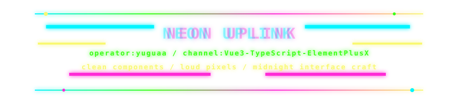
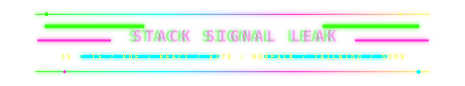
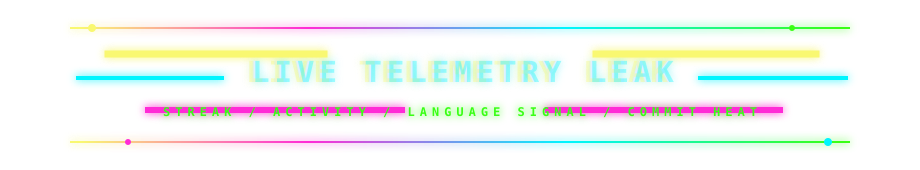
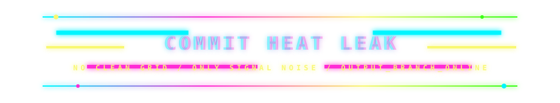

<picture>
  <source media="(prefers-color-scheme: dark)" srcset="https://capsule-render.vercel.app/api?type=waving&height=230&color=0:050816,18:00F5FF,42:111827,68:FF2BD6,100:F9F871&text=Yuguaa&fontAlign=50&fontAlignY=36&fontColor=FFFFFF&fontSize=68&desc=NEON%20FRONTEND%20RUNNER%20%2F%20VUE%20INTERFACE%20CRAFT&descAlign=50&descAlignY=62&animation=twinkling" />
  <source media="(prefers-color-scheme: light)" srcset="https://capsule-render.vercel.app/api?type=waving&height=230&color=0:F8FAFC,26:00A6FF,58:FF2BD6,100:F9F871&text=Yuguaa&fontAlign=50&fontAlignY=36&fontColor=111827&fontSize=68&desc=NEON%20FRONTEND%20RUNNER%20%2F%20VUE%20INTERFACE%20CRAFT&descAlign=50&descAlignY=62&animation=twinkling" />
  
</picture>

  <picture>
    <source media="(prefers-color-scheme: dark)" srcset="https://readme-typing-svg.demolab.com?font=Fira+Code&weight=700&size=24&pause=700&color=00F5FF&center=true&vCenter=true&width=900&lines=%E2%96%88%E2%96%92%E2%96%91+booting+Element+Plus+X;%3E+compiling+Vue3+neon+components;%3E+typing+the+city+with+TypeScript;%E2%96%93%E2%96%92%E2%96%91+shipping+interfaces+after+midnight;%3E+signal+unstable+%2F%2F+build+still+green" />
    <source media="(prefers-color-scheme: light)" srcset="https://readme-typing-svg.demolab.com?font=Fira+Code&weight=700&size=24&pause=700&color=7C3AED&center=true&vCenter=true&width=900&lines=%E2%96%88%E2%96%92%E2%96%91+booting+Element+Plus+X;%3E+compiling+Vue3+neon+components;%3E+typing+the+city+with+TypeScript;%E2%96%93%E2%96%92%E2%96%91+shipping+interfaces+after+midnight;%3E+signal+unstable+%2F%2F+build+still+green" />
    
  </picture>

  
  
  
  

  <picture>
    <source media="(prefers-color-scheme: dark)" srcset="./assets/neon-glitch-strip.svg" />
    <source media="(prefers-color-scheme: light)" srcset="./assets/neon-glitch-strip-light.svg" />
    
  </picture>

  <picture>
    <source media="(prefers-color-scheme: dark)" srcset="./assets/uplink-glitch-gate.svg" />
    <source media="(prefers-color-scheme: light)" srcset="./assets/uplink-glitch-gate-light.svg" />
    
  </picture>

  

  <picture>
    <source media="(prefers-color-scheme: dark)" srcset="./assets/stack-glitch-gate.svg" />
    <source media="(prefers-color-scheme: light)" srcset="./assets/stack-glitch-gate-light.svg" />
    
  </picture>

  

  <picture>
    <source media="(prefers-color-scheme: dark)" srcset="./assets/neon-glitch-strip.svg" />
    <source media="(prefers-color-scheme: light)" srcset="./assets/neon-glitch-strip-light.svg" />
    
  </picture>

  <picture>
    <source media="(prefers-color-scheme: dark)" srcset="./assets/telemetry-glitch-gate.svg" />
    <source media="(prefers-color-scheme: light)" srcset="./assets/telemetry-glitch-gate-light.svg" />
    
  </picture>

  <picture>
    <source media="(prefers-color-scheme: dark)" srcset="https://streak-stats.demolab.com?user=yuguaa&theme=radical&hide_border=true&date_format=%5BY.%5Dn.j" />
    <source media="(prefers-color-scheme: light)" srcset="https://streak-stats.demolab.com?user=yuguaa&theme=default&hide_border=true&date_format=%5BY.%5Dn.j" />
    
  </picture>

  <picture>
    <source media="(prefers-color-scheme: dark)" srcset="https://github-readme-activity-graph.vercel.app/graph?username=yuguaa&custom_title=TRANSMISSION%20GRAPH%20%2F%2F%20COMMIT%20HEAT&hide_border=true&bg_color=00000000&color=F9F871&title_color=FF2BD6&line=00F5FF&point=39FF14&area=true&area_color=FF2BD6" />
    <source media="(prefers-color-scheme: light)" srcset="https://github-readme-activity-graph.vercel.app/graph?username=yuguaa&custom_title=TRANSMISSION%20GRAPH%20%2F%2F%20COMMIT%20HEAT&hide_border=true&bg_color=00000000&color=111827&title_color=7C3AED&line=FF2BD6&point=00A6FF&area=true&area_color=00F5FF" />
    
  </picture>

  <picture>
    <source media="(prefers-color-scheme: dark)" srcset="./assets/neon-glitch-strip.svg" />
    <source media="(prefers-color-scheme: light)" srcset="./assets/neon-glitch-strip-light.svg" />
    
  </picture>

  <picture>
    <source media="(prefers-color-scheme: dark)" srcset="./assets/commit-glitch-gate.svg" />
    <source media="(prefers-color-scheme: light)" srcset="./assets/commit-glitch-gate-light.svg" />
    
  </picture>

  

  <picture>
    <source media="(prefers-color-scheme: dark)" srcset="https://raw.githubusercontent.com/yuguaa/yuguaa/output/github-contribution-grid-snake-dark.svg" />
    <source media="(prefers-color-scheme: light)" srcset="https://raw.githubusercontent.com/yuguaa/yuguaa/output/github-contribution-grid-snake.svg" />
    
  </picture>

  <picture>
    <source media="(prefers-color-scheme: dark)" srcset="./assets/neon-glitch-strip.svg" />
    <source media="(prefers-color-scheme: light)" srcset="./assets/neon-glitch-strip-light.svg" />
    
  </picture>

  <b>TRANSMISSION ENDS. SYSTEM STILL GLOWING.</b>
   
  typed components / midnight builds / rain on the terminal glass

